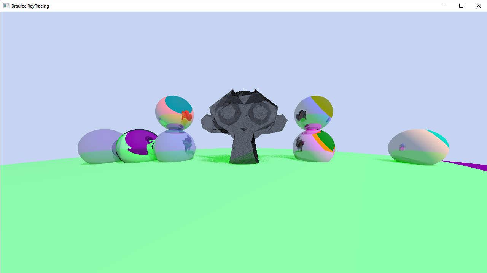

# Ray-Casting-Simulation
Created a very basic Ray Casting simulator using C++ with the SDL2 rendering
Library to allow users to view their scenes real time and track 
performance. Used techniques from RayTracing In One Weekend series with many 
other sources which I will credit at the bottom. 

Implemented multhithreading with ISO C++ 17 Standard version with parallel 
execution on the for loops to speed up perfomance. This can be implemented using 
the command "--DMT" when running the program at the command line. This speeds up 
performance proportional to the number of cores available on the machine. This 
does however occupy all cores on machine unless user goes into their os settings to 
restrict the application from using specific cores, this does slow down the machine
by quite a bit making it unable to run anything else. 

Performance can be better, currently low poly meshes are the only viable option
unless one wants to spend hours rendering an image. An image with a triangle count
of about 200 and a few spheres takes about 2 minutes to render with multithreading 
enabled. This isn't the best performance and would love to learn how to imporove it 
one day.

Since it is created through SDL and Visual Studio 2022, currently it only runs on windows
machines, but not to any specific hardware. Downloading the project files and 
compiling it on linux machines should work as well though. 

Mainly used this project to learn more about C++, graphics rendering, mathematics, 
and more; so don't look into this project expecting high level code or renders. Would 
appreciate any feedback given on performance boosters, code readablity, and anything 
constructive though! 

# Rendered Images

# References
  - 
  - 
  - 
  - 

